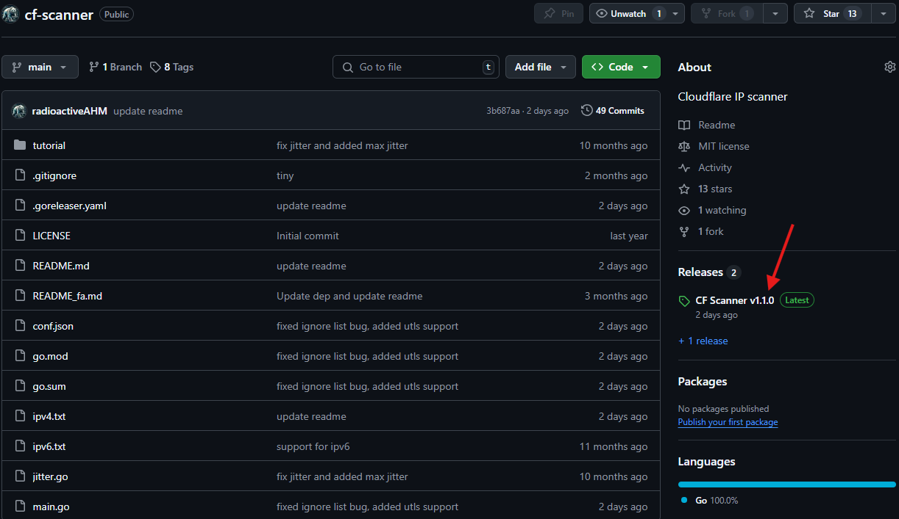
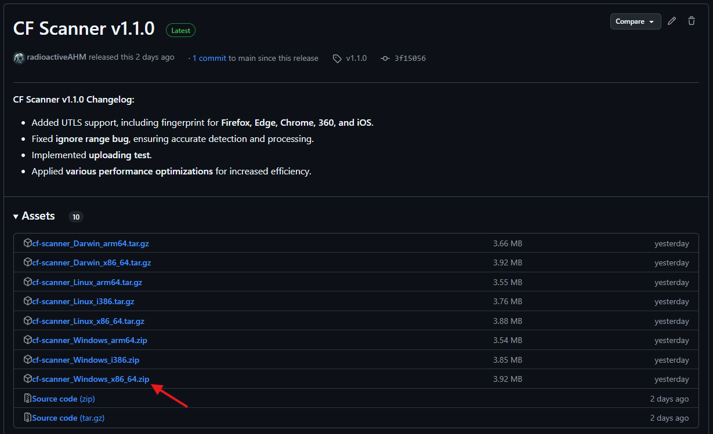
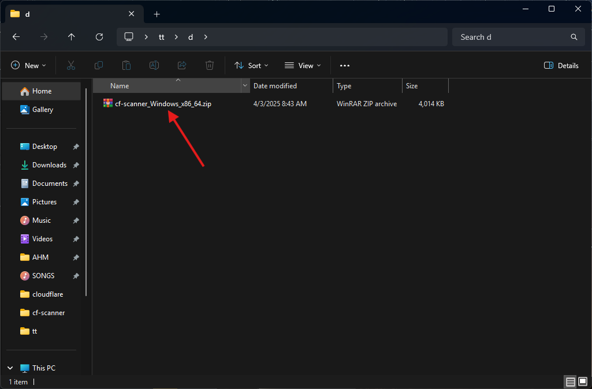
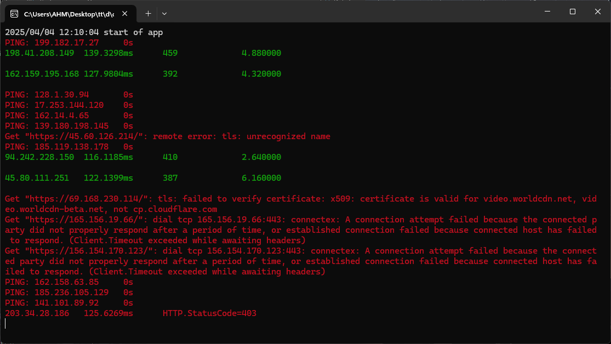
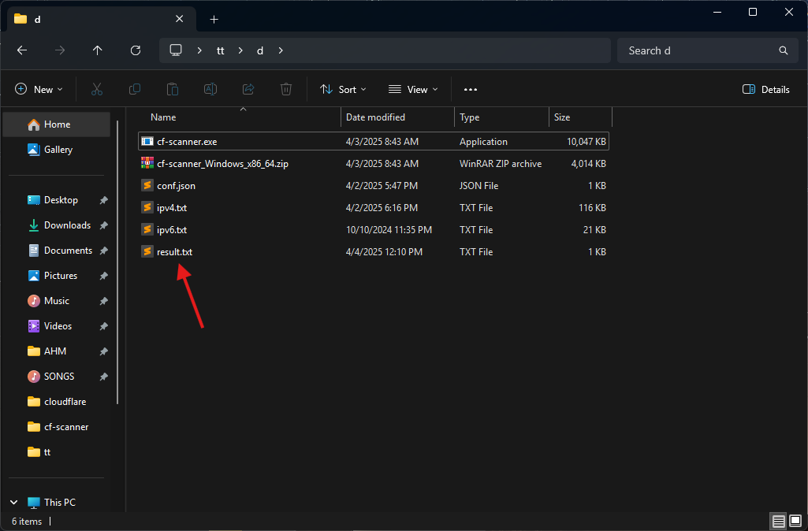
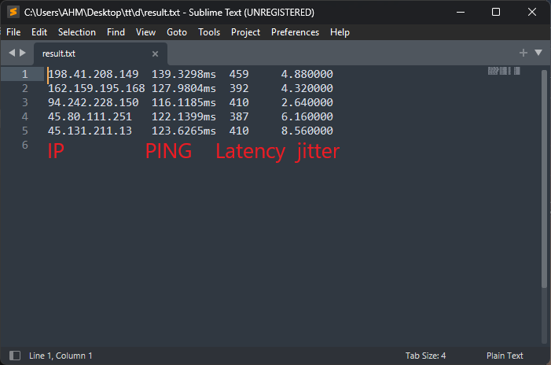

# آموزش (Windows)

1. ابتدا فایل مورد نیاز از بخش Releases دانلود کنید

    - 

    - 

2. فایل زیپ دانلود شده را از حالت فشرده خارج کنید

    - 

3. نیازی به تغییر فایل کانفیگ نیست و اسکنر را اجرا کنید cf-scanner.exe

4. خروجی اسکنر هنگام اسکن به این شکل خواهد بود

    - 
    - نتایج سبز رنگ نتایج مثبت هستند که در فایل خروجی result.txt نوشته میشوند
    - نتایج زرد رنگ نشانگر بالاتر بودن جیتر از مقدار مشخص شده در کانفیگ میباشد

5. خروجی های مثبت در فایل result.txt نوشته شده اند.

    - 
    - 

**شما میتوانید از اسکنر درحال اجرا خارج بشوید و همچنان خروجی ها را در فایل `result.exe` داشته باشید**

## نکات

- گزینه `Goroutines` در فایل کانفیگ برای تعداد اسکن های همزمان میباشد. با افزایش این مقدار اسکن سریع تری خواهید داشت ولی درصد خطا تاخیر افزایش میابد
- گزینه `HTTP/3` مناسب کانفیگ XHTTP H3
- گزینه `HTTP/3` , `Noise` مناسب کانفیگ XHTTP H3 Noise
- اگر تست سرعت `DownloadTest` فعال باشد مقدار `Goroutines` بر روی 1 تنظیم کنید
- سرعت اسکن به `Goroutines`, `MaxPing`, `Maxlatency` و `JitterInterval` وابسته است
